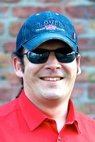


<table class="AboutUs" border="0">
<tbody>
<tr>
<td class="im"></td>
<td class="im"></td>
</tr>
</tbody>
</table>
<table class="AboutUs" border="0">
<tbody>
<tr>
<td class="fine">

Леонид Дубляков

вокал, перкуссия, тексты, сценическая хореография

 Главный идеолог. Подвержен эмоциональным взрывам. Харизматичен. Коммуникабелен. Любые трудности ему нипочем. Всегда нацелен на результат. Стремится ко всему хорошему. Очень дружелюбен. Точен во всяких подсчётах. Часто проявляет инициативу по любому поводу. Склонен к самокопанию, но успешно борется с рождёнными им самим сомнениями. От всех и вся ждёт и требует конкретики и ясности. Девиз жизни: «Не важно, что происходит, важно – как ты к этому относишься».</td>
</tr>
</tbody>
</table>
<table class="AboutUs" border="0">
<tbody>
<tr>
<td class="im"></td>
<td class="im"></td>
</tr>
</tbody>
</table>
<table class="AboutUs" border="0">
<tbody>
<tr>
<td class="fine">

Сергей Сук

бас-гитара, тексты-2, секретарь по связям с общественностью, архивариус

 Сторож совести. Не антисемит. Главный вопрос в жизни: «Покажите мне, что такое время?». Может быть, поэтому часто опаздывает на репетиции. В музыке вечно что-то ищет и часто находит. Профессия – друг общественности. Закоренелый пацифист. Круг обязанностей: играть в унисон с ударными, систематизировать информацию, в печатном виде обеспечивая ею коллектив, не дурить.</td>
</tr>
</tbody>
</table>
<table class="AboutUs" border="0">
<tbody>
<tr>
<td class="im"></td>
<td class="im"></td>
</tr>
</tbody>
</table>
<table class="AboutUs" border="0">
<tbody>
<tr>
<td class="fine">

Евгений Моисей

гитара, координатор стратегии развития, идеолог

 Главный критик творчества группы. Агитатор и пропагандист всего нового. Талантливо обосновывает идеи, обладает исключительной способностью к убеждению. Верит в коллектив, как в себя. Очень, очень часто проявляет инициативу по любому поводу. Готов посвятить всего себя ради безостановочного прогресса. В связях, порочащих творческую личность, замечен не был.</td>
</tr>
</tbody>
</table>
<table class="AboutUs" border="0">
<tbody>
<tr>
<td class="im"></td>
<td class="im"></td>
</tr>
</tbody>
</table>
<table class="AboutUs" border="0">
<tbody>
<tr>
<td class="fine">

Максим Кривобородов

соло-гитара, аранжировка, чистильщик партитур

 Сумасшедший укротитель шести струн. Может всё разложить по полочкам для любого инструмента. Ходячая рок-энциклопедия. Говорит редко, но исключительно – в точку. В коллективе имеет статус честного, неподкупного и ответственного товарища. Холост. К привычкам, уничтожающим человеческую личность, не склонен.</td>
</tr>
</tbody>
</table>
<table class="AboutUs" border="0">
<tbody>
<tr>
<td class="im"></td>
<td class="im"></td>
</tr>
</tbody>
</table>
<table class="AboutUs" border="0">
<tbody>
<tr>
<td class="fine">

Дмитрий Дейбус

барабаны, дисциплинарный куратор, источник бесперебойного звука

 Ещё один очень, очень энергичный молодой человек с прекрасной памятью! Обладает всеми необходимыми качествами для контрольно-дисциплинарной функции в коллективе. Постоянный акустический источник информации. Надёжен как в ритме, так и в жизни. Живёт в соответствии с сентенцией: «Веселье делу не помеха, но дело, всё-таки, главней!»</td>
</tr>
</tbody>
</table>
<table class="AboutUs" border="0">
<tbody>
<tr>
<td class="im"></td>
<td class="im"></td>
</tr>
</tbody>
</table>
<table class="AboutUs" border="0">
<tbody>
<tr>
<td class="fine">

Александр Руденко

тромбон, стартер духовой секции, ответственный за пунктуальность

Первый завербованный в группу из нынешних духовиков, психологически правильно обработанный и подготовивший комфортную площадку для прихода остальных. Долго не сопротивлялся. Вообще не сопротивлялся! Идеи схватывает на лету, по-прежнему являясь в группе своеобразным мостиком между отдельным миром духовых инструментов и струнно-ударной частью группы.

</td>
</tr>
</tbody>
</table>
<table class="AboutUs" border="0">
<tbody>
<tr>
<td class="im"></td>
<td class="im"></td>
</tr>
</tbody>
</table>
<table class="AboutUs" border="0">
<tbody>
<tr>
<td class="fine">

Богдан Телиженко

саксофон, кларнет, нотно-аккустический критик, а на самом деле – кто его знает!

 Действительно, Человек-себе на уме, но его интровертность – это как бы некий котёл идей, нот и звуков, который после некоторого броуновского брожения во всех доступных плоскостях взрывается исключительно вкусной и идеально контекстной музыкальной партией.</td>
</tr>
</tbody>
</table>
<table class="AboutUs" border="0">
<tbody>
<tr>
<td class="im"></td>
<td class="im"></td>
</tr>
</tbody>
</table>
<table class="AboutUs" border="0">
<tbody>
<tr>
<td class="fine">

Артур Жуковский

труба, всё на уме, точнейшее воспроизведение звуков

 Молчит ровно столько, сколько необходимо для формирования мысли и выслушивания творческих дебатов соратников, чтобы потом одной фразой расставить большинство точек над i. По утверждению коллег по цеху – мега-мозг и очень коммуникабельный человек. Как и все в нашей духовой гильдии – ответственный и чертовски талантливый.</td>
</tr>
</tbody>
</table>


